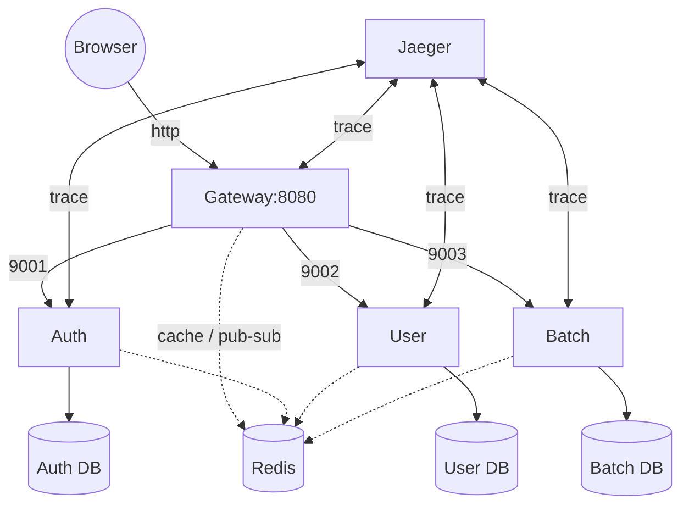
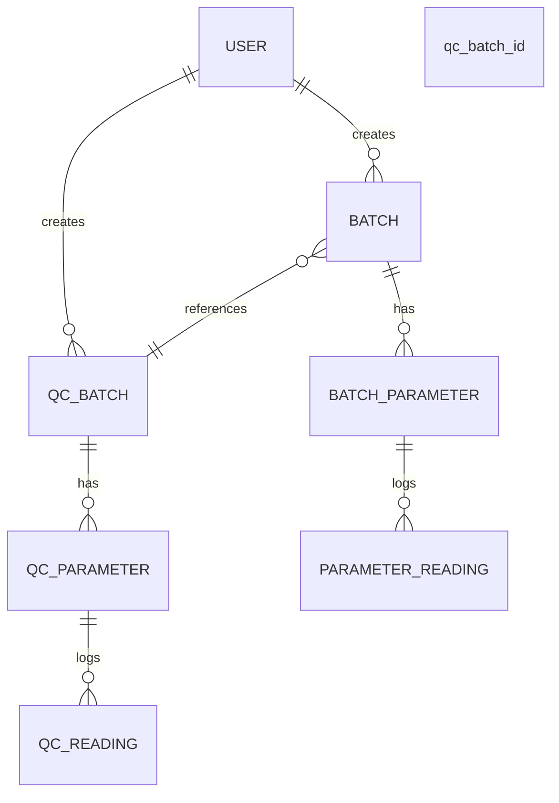

# Bioprocess Analytics – Micro-service Design Specification

> version 2.2 ‑ 2025-10-23 ‑ **env-aware edition**
> “Living document” – update whenever code or `.env` changes.

## 1. Folder & File Map (snapshot)

bioprocess-analytics-micro/
├── README.md
├── BioprocessAnalyticsDesignSpecs.md   ← this file
├── .env                                 ← single source of truth (SSOT)
├── .env.example                         ← template for new hires
├── docker-compose.yml                   ← dev & prod profiles
├── detect-and-install.sh
├── setup-system-deps.sh
├── setup-dev-env.sh
├── run_migrations_bash_dev_testing.sh
├── run_migrations_bash_prod_untested.sh
├── port_clean_up.sh
│
├── gateway/
│   ├── main.py
│   ├── requirements.txt
│   ├── Dockerfile
│   └── .venv/                           # git-ignored
│
├── services/
│   ├── auth/
│   │   ├── app/…
│   │   ├── alembic/
│   │   ├── Dockerfile
│   │   ├── requirements.txt
│   │   └── alembic.ini
│   ├── user/   (mirror structure)
│   └── batch/  (mirror structure)
│
├── shared/                              # cross-cutting kit
│   ├── config.py        # reads .env via pydantic
│   ├── security.py
│   ├── event_bus.py
│   ├── metrics.py
│   ├── tracing.py
│   └── __init__.py
│
└── .vscode/
    ├── launch.json
    ├── tasks.json
    └── extensions.json

## 2. Port & DNS Matrix (extracted from `.env`)

| Container Name | Internal DNS | Host Port | Container Port | Health Route     | Env Prefix           |
| -------------- | ------------ | --------- | -------------- | ---------------- | -------------------- |
| gateway        | `gateway`    | 8080      | 8080           | `/health`        | `GATEWAY_*`          |
| auth           | `auth`       | 9001      | 9001           | `/healthz`       | `AUTH_*`             |
| user           | `user`       | 9002      | 9002           | `/healthz`       | `USER_*`             |
| batch          | `batch`      | 9003      | 9003           | `/healthz`       | `BATCH_*`            |
| redis          | `redis`      | 6379      | 6379           | `redis-cli ping` | `REDIS_*`            |
| jaeger         | `jaeger`     | 16686     | 16686          | n/a              | `JAEGER_*`           |
| postgres-auth  | `db_auth`    | 54320     | 5432           | `pg_isready`     | `AUTH_DATABASE_URL`  |
| postgres-user  | `db_user`    | 54321     | 5432           | `pg_isready`     | `USER_DATABASE_URL`  |
| postgres-batch | `db_batch`   | 54322     | 5432           | `pg_isready`     | `BATCH_DATABASE_URL` |

> **Note:** URLs above are **already injected** in `.env` – no hard-coding elsewhere.

## 3. Runtime Architecture (C4 container view)



## 4. Entity Relationship (env-agnostic)



## 5. Environment Variables (SSOT)

> Copy `.env.example` → `.env` and **never commit the real `.env`**.

### 5.1 Application Core

| Variable          | Default                | Notes                                   |
| ----------------- | ---------------------- | --------------------------------------- |
| `ENVIRONMENT`     | `development`          | Switches tracing, SQL echo, debug flags |
| `SERVICE_NAME`    | `bioprocess-analytics` | Used by Jaeger & logs                   |
| `SERVICE_PORT`    | `8080`                 | Gateway port                            |
| `SERVICE_HOST`    | `0.0.0.0`              | Binds inside container                  |
| `SERVICE_WORKERS` | `1`                    | Uvicorn workers                         |
| `LOG_LEVEL`       | `INFO`                 | Python logging level                    |
| `LOG_FORMAT`      | `text`                 | `json` for prod aggregators             |

### 5.2 Security (mandatory)

| Variable                      | Example        | Notes                     |
| ----------------------------- | -------------- | ------------------------- |
| `SECRET_KEY`                  | 64-char string | HS256 signing key         |
| `FERNET_KEY`                  | 32-bytes b64   | Encryption of PII at rest |
| `JWT_ALGORITHM`               | `HS256`        | Keep                      |
| `ACCESS_TOKEN_EXPIRE_MINUTES` | `60`           | Sliding window            |
| `REFRESH_TOKEN_EXPIRE_DAYS`   | `7`            | Long-lived refresh        |
| `BCRYPT_ROUNDS`               | `12`           | Cost factor               |
| `RATE_LIMIT_PER_MINUTE`       | `100`          | Gateway throttle          |
| `RATE_LIMIT_BURST`            | `20`           | Allow short spikes        |

### 5.3 Database URLs (dev)

| Variable             | URL                                                          |
| -------------------- | ------------------------------------------------------------ |
| `AUTH_DATABASE_URL`  | `postgresql+psycopg2://authuser:password@db_auth:5432/authdb` |
| `USER_DATABASE_URL`  | `postgresql+psycopg2://useruser:password@db_user:5432/userdb` |
| `BATCH_DATABASE_URL` | `postgresql+psycopg2://batchuser:password@db_batch:5432/batchdb` |

**Performance knobs**
`DB_POOL_SIZE=20`, `DB_MAX_OVERFLOW=30`, `DB_POOL_TIMEOUT=30`, `DB_POOL_RECYCLE=3600`, `DB_ECHO=false`

### 5.4 Redis

| Variable                       | Default                |
| ------------------------------ | ---------------------- |
| `REDIS_URL`                    | `redis://redis:6379/0` |
| `REDIS_PASSWORD`               | *empty*                |
| `REDIS_MAX_CONNECTIONS`        | `50`                   |
| `REDIS_SOCKET_TIMEOUT`         | `5`                    |
| `REDIS_SOCKET_CONNECT_TIMEOUT` | `5`                    |
| `REDIS_RETRY_ON_TIMEOUT`       | `true`                 |
| `REDIS_HEALTH_CHECK_INTERVAL`  | `30`                   |

### 5.5 Observability

| Variable                 | Default    |
| ------------------------ | ---------- |
| `JAEGER_AGENT_HOST`      | `jaeger`   |
| `JAEGER_AGENT_PORT`      | `6831`     |
| `JAEGER_SAMPLER_TYPE`    | `const`    |
| `JAEGER_SAMPLER_PARAM`   | `1.0`      |
| `METRICS_PORT`           | `9090`     |
| `METRICS_PATH`           | `/metrics` |
| `GRAFANA_ADMIN_PASSWORD` | `admin`    |
| `GRAFANA_PORT`           | `3000`     |

### 5.6 Feature Flags

| Flag                   | Default | Meaning                    |
| ---------------------- | ------- | -------------------------- |
| `ENABLE_TRACING`       | `true`  | OpenTelemetry on/off       |
| `ENABLE_METRICS`       | `true`  | Prometheus counters        |
| `ENABLE_RATE_LIMITING` | `true`  | Gateway token-bucket       |
| `ENABLE_CORS`          | `true`  | CORS middleware            |
| `ENABLE_SSL`           | `false` | Terminate TLS at container |
| `DEBUG`                | `true`  | FastAPI debug switch       |
| `DEBUG_SQL`            | `false` | SQLAlchemy echo            |
| `AUTO_RELOAD`          | `true`  | Uvicorn reload             |
| `HOT_RELOAD`           | `true`  | VS-code debugger friendly  |

### 5.7 CORS

```
CORS_ORIGINS=http://localhost:3000,http://localhost:8080,http://127.0.0.1:3000,http://127.0.0.1:8080
```

### 5.8 Internal Service URLs (Docker DNS)

| Variable            | URL                   |
| ------------------- | --------------------- |
| `AUTH_SERVICE_URL`  | `http://auth:9001`    |
| `USER_SERVICE_URL`  | `http://user:9002`    |
| `BATCH_SERVICE_URL` | `http://batch:9003`   |
| `GATEWAY_URL`       | `http://gateway:8080` |

### 5.9 SSL/TLS (when `ENABLE_SSL=true`)

| Variable                  | Example                    |
| ------------------------- | -------------------------- |
| `SSL_CERT_PATH`           | `/etc/ssl/certs/cert.pem`  |
| `SSL_KEY_PATH`            | `/etc/ssl/private/key.pem` |
| `SSL_PROTOCOLS`           | `TLSv1.2,TLSv1.3`          |
| `HSTS_MAX_AGE`            | `31536000`                 |
| `HSTS_INCLUDE_SUBDOMAINS` | `true`                     |
| `HSTS_PRELOAD`            | `true`                     |

### 5.10 Backup & Alerting (prod placeholders)

| Variable                | Example                       |
| ----------------------- | ----------------------------- |
| `BACKUP_ENABLED`        | `false`                       |
| `BACKUP_SCHEDULE`       | `0 2 * * *`                   |
| `BACKUP_RETENTION_DAYS` | `30`                          |
| `BACKUP_S3_BUCKET`      | `your-backup-bucket`          |
| `BACKUP_ENCRYPTION_KEY` | `your-backup-encryption-key`  |
| `ALERT_MANAGER_URL`     | `http://alertmanager:9093`    |
| `SLACK_WEBHOOK_URL`     | `https://hooks.slack.com/...` |
| `EMAIL_SMTP_HOST`       | `smtp.gmail.com`              |
| `EMAIL_SMTP_PORT`       | `587`                         |
| `EMAIL_USERNAME`        | `abhilashmohan@gmail.com`     |
| `EMAIL_PASSWORD`        | `HiddenForSecurity'           |

## 6. Gateway Deep Dive (feature matrix)

| Capability           | Implementation Detail                             | Env Knob                |
| -------------------- | ------------------------------------------------- | ----------------------- |
| **Service map**      | `SERVICE_MAP` dict (prefix ➜ container)           | –                       |
| **JWT verify**       | `GET /auth/verify` (internal)                     | –                       |
| **Rate limit**       | Token-bucket (`ZSET`) – 100 rpm                   | `RATE_LIMIT_PER_MINUTE` |
| **Circuit breaker**  | 5 fails → 60 s open → half-open                   | hard-coded              |
| **CORS**             | Dynamic origins                                   | `CORS_ORIGINS`          |
| **Security headers** | `X-Content-Type-Options`, `X-Frame-Options=DENY`… | –                       |
| **Metrics**          | Prometheus `/metrics`                             | `ENABLE_METRICS`        |
| **Tracing**          | OpenTelemetry w/ Jaeger thrift-udp                | `ENABLE_TRACING`        |

## 7. Shared Library (`shared/` – mounted into every container)

| Module         | Key APIs                                                     |
| -------------- | ------------------------------------------------------------ |
| `config.py`    | `get_settings()` – cached `pydantic` object, validates keys at start-up |
| `security.py`  | `SecurityManager` – `validate_password_strength()`, `sanitize_input()`, `encrypt_sensitive_data()` |
| `event_bus.py` | `event_bus.publish_event(EventType.USER_CREATED, payload)` – Redis pub/sub + 7 d log |
| `metrics.py`   | `@track_requests("batch-service")`, `@track_db_queries(...)` – auto Prometheus |
| `tracing.py`   | `setup_tracing(app, "batch-service")` – instruments FastAPI, SQLA, Redis |

## 8. Development Inner-Loop (VS-Code)

1. Clone repo.
2. Open root → terminal → `./setup-dev-env.sh` (idempotent).
3. Press `F5` → pick **“All micro-services”** compound.
4. Swagger links printed in DEBUG CONSOLE:
   - Gateway: http://localhost:8080/docs
   - Auth: http://localhost:9001/docs
   - User: http://localhost:9002/docs
   - Batch: http://localhost:9003/docs
   - Jaeger: [http://localhost:16686](http://localhost:16686/)
5. Set breakpoints in any service – **independent debug servers**.

## 9. Production Deployment (outside VS-Code)

1. `docker-compose --profile prod build` (no DB containers).
2. Push images to registry.
3. Provide external Postgres & Redis (TLS).
4. Inject secrets via Vault / AWS Secrets Manager.
5. Run `./run_migrations_bash_prod_untested.sh` (backs-up, migrates, verifies).
6. Deploy to K8s / ECS / Swarm behind ingress.
7. Set `ENVIRONMENT=production`, `DEBUG=false`, rotate `SECRET_KEY`, `FERNET_KEY`.
8. Enable `PodDisruptionBudget`, `HorizontalPodAutoscaler`, `NetworkPolicy`.
9. Scrape `/metrics` via Prometheus ServiceMonitor.
10. Forward traces to central Jaeger collector (gRPC).

------

## 10. Changelog

| Date       | Ver  | Notes                                                        |
| ---------- | ---- | ------------------------------------------------------------ |
| 2025-10-23 | 2.2  | Merged **complete `.env`** into design spec; added SSL, backup, alerting sections; aligned all defaults with `.env` values. |