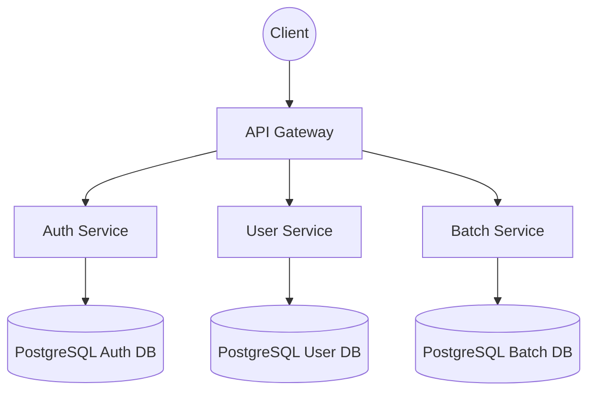
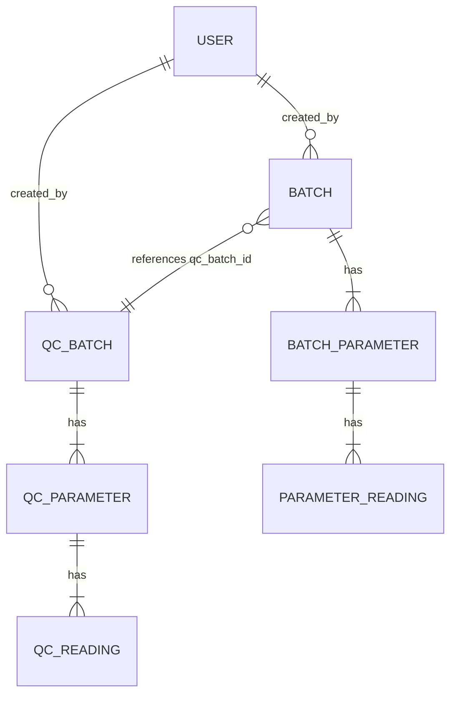

# Bioprocess Analytics : Design Specs

**Folder Structure**

bioprocess-analytics-micro/
├── README.md
├── docker-compose.yml
├── .env.example
├── gateway/
│   ├── main.py
│   ├── requirements.txt
├── services/
│   ├── auth/
│   │   ├── app/
│   │   │   ├── main.py
│   │   │   ├── api.py
│   │   │   ├── models.py
│   │   │   ├── db.py
│   │   │   ├── auth.py
│   │   │   ├── exceptions.py
│   │   │   └── utils.py
│   │   ├── requirements.txt
│   │   ├── alembic.ini
│   │   ├── alembic/
│   │   └── Dockerfile
│   ├── user/
│   │   ├── app/
│   │   │   ├── main.py
│   │   │   ├── api.py
│   │   │   ├── models.py
│   │   │   ├── db.py
│   │   │   ├── users.py
│   │   │   ├── exceptions.py
│   │   │   └── utils.py
│   │   ├── requirements.txt
│   │   ├── alembic.ini
│   │   ├── alembic/
│   │   └── Dockerfile
│   └── batch/
│       ├── app/
│       │   ├── main.py
│       │   ├── api.py
│       │   ├── models.py
│       │   ├── db.py
│       │   ├── batches.py
│       │   ├── qcbatches.py
│       │   ├── exceptions.py
│       │   └── utils.py
│       ├── requirements.txt
│       ├── alembic.ini
│       ├── alembic/
│       └── Dockerfile

**System Architecture**

**Batch Entity Relationship**

